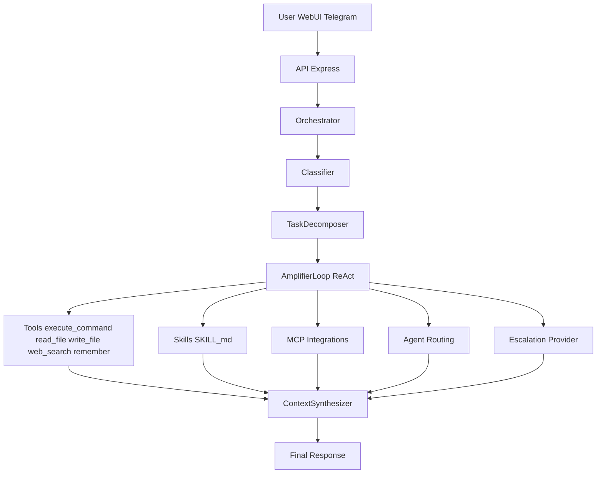

# Enzo

Asistente personal inteligente, local y extensible.

Enzo combina orquestacion multi-paso, herramientas del sistema, skills y canales (Web UI + Telegram) para entregar una experiencia de asistente real sobre modelos base pequenos, con opcion de escalar a proveedores mas potentes cuando se necesita.

## Proyecto en fase inicial

Este proyecto esta en etapa temprana (alpha). Ya es util para uso diario, pero seguimos priorizando robustez, seguridad, experiencia de usuario y nuevas capacidades antes de una publicacion mas amplia.

## Why Enzo

- **Local first:** pensado para correr en tu hardware con Ollama como base.
- **Orquestacion real:** no solo chat; usa clasificacion de complejidad, descomposicion y ciclo ReAct.
- **Extensible por diseno:** integra tools propias, skills (`SKILL.md`) y servidores MCP.
- **Multicanal:** misma logica de asistente para Web UI y Telegram.
- **Escalable:** puede elevar tareas complejas a modelos superiores cuando aplica.

## Demo y UI

Puedes agregar capturas o gifs aqui para mejorar conversion en GitHub:

- `docs/assets/web-ui-chat.png`
- `docs/assets/web-ui-config.png`
- `docs/assets/telegram-demo.gif`

## Arquitectura



## Stack

- **Core:** Node.js + TypeScript
- **API:** Express
- **UI:** React + Vite
- **DB:** SQLite
- **Base model:** Ollama
- **Optional providers:** Anthropic, OpenAI, Gemini
- **Channels:** Web UI, Telegram

## Capacidades actuales

- Conversacion natural en espanol
- Ejecucion de comandos del sistema
- Lectura y escritura de archivos
- Busqueda web
- Memoria semantica por usuario
- Descomposicion de tareas complejas
- Skills basados en standard `SKILL.md`
- Integracion con servidores MCP
- Onboarding por CLI

## Requisitos

Requiere Node.js 22.5.0 o superior (usa `node:sqlite` nativo). Recomendado `pnpm` 9+.

## Quickstart

```bash
git clone https://github.com/flucastr/Flucastr.Enzo.git
cd Flucastr.Enzo
corepack enable
pnpm install
pnpm run setup
pnpm dev
```

Servicios por defecto:

- Web UI: `http://localhost:5173`
- API: `http://127.0.0.1:3001` (host configurable con `ENZO_API_HOST`)

## Uso

```bash
pnpm dev
./enzo setup
./enzo start
./enzo status
./enzo stop
./enzo update
```

## Servicio systemd (user)

Para un `/update` robusto en Telegram, instala Enzo como servicio de usuario (recomendado):

```bash
./scripts/install-systemd-user.sh
```

Este instalador:
- crea `~/.config/systemd/user/enzo.service`
- genera `scripts/run-enzo-systemd.sh`
- autodetecta `fnm`/`node`/`pnpm` para evitar problemas de PATH en `systemd --user`

Comandos utiles:

```bash
systemctl --user status enzo
journalctl --user -u enzo -f
```

Desinstalar:

```bash
./scripts/uninstall-systemd-user.sh
```

Comandos por paquete:

```bash
pnpm -F @enzo/api dev
pnpm -F @enzo/ui dev
```

## Configuracion

El archivo principal vive en:

```text
~/.enzo/config.json
```

Ejemplo valido:

```json
{
  "primaryModel": "qwen2.5:7b",
  "providers": {
    "anthropic": {
      "apiKeyEncrypted": "<encrypted>"
    }
  },
  "system": {
    "ollamaBaseUrl": "http://localhost:11434",
    "anthropicModel": "claude-haiku-4-5",
    "port": "3001",
    "dbPath": "./enzo.db",
    "enzoWorkspacePath": "./workspace",
    "enzoSkillsPath": "~/.enzo/skills",
    "mcpAutoConnect": true,
    "telegramBotTokenEncrypted": "<encrypted>",
    "telegramAllowedUsers": "12345678",
    "enzoDebug": false
  }
}
```

## Seguridad

- La API esta orientada a uso local y actualmente no tiene autenticacion nativa.
- No expongas puertos de Enzo a internet sin un proxy con autenticacion y TLS.
- Revisa `SECURITY.md` para reportes responsables.

## Roadmap (fase inicial)

Features y mejoras priorizadas:

- [ ] MCPs (no esta funcionando perfecto y quedara como futura feature)
- [ ] Sistema de onboarding conversacional
- [ ] Agregar un token de seguridad de acceso a la web ui (mas bien las apis)
- [ ] Mejorar el formato de los mensajes en telegram
- [ ] Mejorar el formato de los mensajes en la web ui
- [ ] Limpieza, refactorizacion, readme y publicacion
- [ ] Para el modelo principal de asistente solo esta aceptando configurar un modelo de Ollama
- [ ] Definir si replicar los comandos de telegram en el chat de la web ui
- [ ] Feature de ver imagenes
- [ ] Feature de subir archivos
- [ ] Feature de hablar con el asistente con audio y que el responda con audios tambien
- [ ] Feature de descarga de archivos por telegram
- [ ] Mejorar la estadistica de consumo

## Contribuir

PRs bienvenidos.

- `CONTRIBUTING.md`: guia de desarrollo y checklist de PR.
- `SECURITY.md`: reporte de vulnerabilidades.

Orden sugerido para leer el codigo:

1. `packages/core/src/orchestrator/`
2. `packages/api/src/`
3. `packages/ui/src/`
4. `packages/telegram/src/`
5. `packages/cli/src/`

## Licencia

MIT
